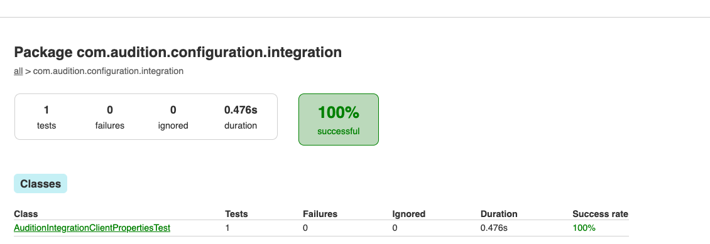
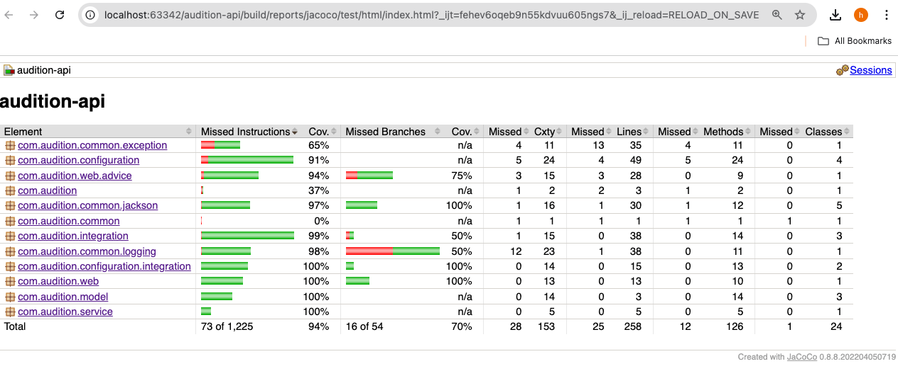
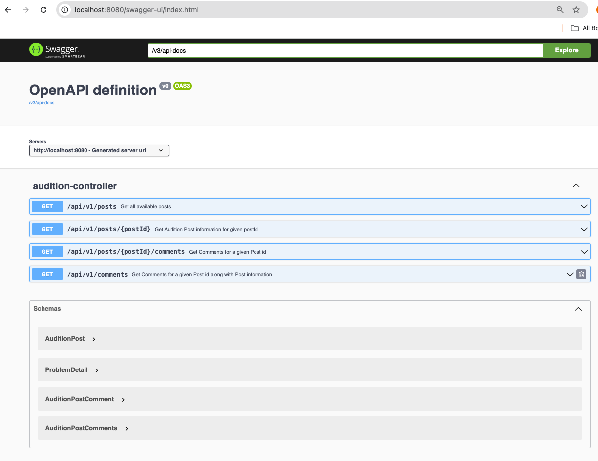
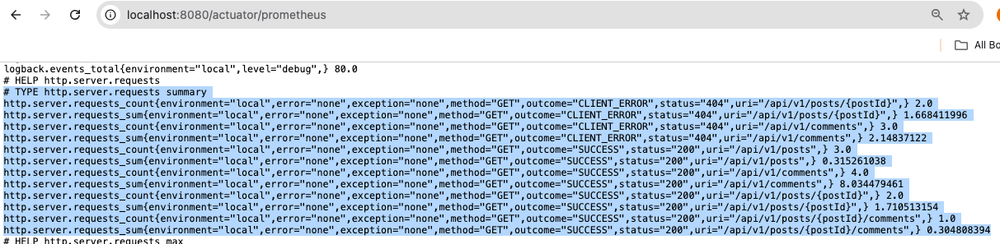
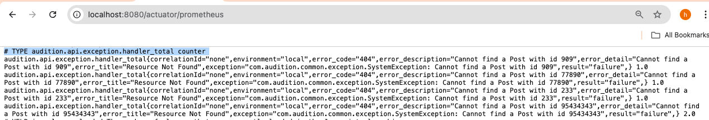
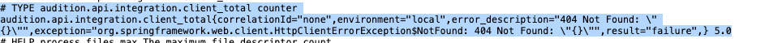

<!-- Title -->

# [Audition Api Application](https://github.com/NeatCodersAus/audition-api) &middot; [](https://github.com/NeatCodersAus/audition-api/blob/develop/LICENSE) [](https://github.com/corretto/corretto-17/releases/tag/17.0.12.7.1) [](https://docs.gradle.org/8.10.2/release-notes.html) [](https://github.com/spring-projects/spring-boot/wiki/Spring-Boot-3.0-Release-Notes)  [](https://github.com/spring-cloud/spring-cloud-release/wiki/Spring-Cloud-2022.0-Release-Notes)

This is a simple application to demonstrate my skill set in Java, SpringBoot and its related
common concepts/frameworks.

## API endpoints available with in the app:

* http://localhost:8080/api/v1/posts to retrieve all posts data exposed from https://jsonplaceholder.typicode.com/posts
    * additionally this endpoint supports querying by userId and/or title fields to filter data using queryParameters
* http://localhost:8080/api/v1/posts/{postId} to retrieve a specific post information
  from https://jsonplaceholder.typicode.com/posts/{postId}
* http://localhost:8080/api/v1/posts/{postId}/comments to retrieve all comments along with post information for a given
  postId
  from https://jsonplaceholder.typicode.com/posts/{postId}/comments
* http://localhost:8080/api/v1/comments?postId={postId} to retrieve all comments data only
  from https://jsonplaceholder.typicode.com/comments?postId={postId}
  Full contract details are available inside swagger spec.

----

<!-- Assumptions -->

## Assumptions/Out of scope.

* **Security :** Securing endpoints that are exposed is not requested for MVP
* **Security :** Normal SSL communication between this app and `jsonplaceholder.typicode.com` no security tokens being
  used.
* **Dev Machine:** Steps below for build and run etc are based on assumption that developer/code user is using a MAC OS.
* **Persistence:** No persistence is required. Once process is killed data is gone.
* **Caching:** No caching is required. Application queries https://jsonplaceholder.typicode.com for each request.
* **Load/Performance:** Not tested and not supported.

----

<!-- TechStack -->

### Tech Stack

<details>
  <summary>Server</summary>
  <ul>
    <li><a href="https://github.com/corretto/corretto-17/releases/tag/17.0.12.7.1">Java-Amazon Corretto 17</a></li>
    <li><a href="https://gradle.org/">Gradle</a></li>
    <li><a href="https://spring.io/projects/spring-boot/">Spring Boot (REST)</a></li>
  </ul>
</details> 

----

## Please visit/complete all instructions under `InitialDeveloperSetup.md` if the developer machine is not setup.

----

## Prerequisites

To follow along you need to have Java installed **OpenJDK or Amazon corretto is fine**

Latest Corretto Java 17 version at the time of writing this
is [17.0.12.7.1](https://github.com/corretto/corretto-17/releases/tag/17.0.12.7.1)  so just using that.

Developers are expected to have following tools.

- MacOS Sonoma or above - This app is tested on Intel chip but M1 or other mac chips also should be alright.
- Homebrew (https://brew.sh/) (to get sdkman)
- IntelliJ (https://www.jetbrains.com/idea/download/#section=mac)
- Docker (not a must but good to have)

----

## Clone repo

* Use any IDE (I am using IntelliJ but VSCode or Eclipse also should be fine) to import project from source repository.
    * With in IDE : Refer to
      steps [here](https://www.jetbrains.com/help/idea/manage-projects-hosted-on-github.html#clone-from-GitHub) to clone
      using Intellij.
    * To clone from a terminal execute command
      ``` git clone https://github.com/NeatCodersAus/audition-api.git audition-api ```

----

## Build

Open a command terminal and execute following

```
./gradlew clean build
```

This will build your application and generate libs/artifacts under
{rootFolder}/build/libs/audition-api-0.0.1-SNAPSHOT.jar
You should see similar output as below

```
If using gradle 8.10.2 for the first on the machine,then it will download it as part of the build and you should see

Downloading https://services.gradle.org/distributions/gradle-8.10.2-bin.zip
.............10%.............20%.............30%.............40%.............50%.............60%.............70%.............80%........90%.......100%

Welcome to Gradle 8.10.2!

Here are the highlights of this release:
 - Support for Java 23
 - Faster configuration cache
 - Better configuration cache reports
 
Starting a Gradle Daemon, 2 stopped Daemons could not be reused, use --status for details

..
..
..

BUILD SUCCESSFUL in 5m 9s
18 actionable tasks: 18 execute

```

Note : First time build will take time (as you can see here it took 5minutes) but subsequent builds should be less than
1 minute.

## Reports generated

Following reports are generated after build

* Junit - build/reports/tests/test/index.html
* checkstyle - build/reports/checkstyle/{main/test}.html
* spotbugs - build/reports/spotbugs/{main/test}.html
* jacoco - build/reports/jacoco/test/html/index.html
* pmd - build/reports/pmd/{main/test}.html

## Run Integration tests

Open a command terminal and execute following

```
./gradlew test # runs both unit and integration tests and finally generates tests reports and jacoco codecoverage report also
```

## Run a particular unit/integration test

Open a command terminal and execute following

```
./gradlew test --tests com.audition.configuration.integration.AuditionIntegrationClientPropertiesTest
```

## Run a particular test method within a unit/integration test

Open a command terminal and execute following

```
./gradlew test --tests com.audition.configuration.integration.AuditionIntegrationClientPropertiesTest.testGetAuditionPostsUri

After finishing with BUILD SUCCESSFUL, 
you should be able to go to build/reports/tests/test/index.html and verify it is successful
```



## Running code quality checks

There are three code quality analysis tools that we regularly run, spotbugs pmd, and checkstyle.

#### Checkstyle

```
./gradlew checkstyleMain checkstyleTest
```

The checkstyle warnings will be found in `reports/checkstyle/reports/main.html` and
`reports/checkstyle/reports/test.html` files in the subproject build directories. They are also printed to the console.
The build will fail if Checkstyle fails.

#### Spotbugs

```
./gradlew spotbugsMain spotbugsTest -x test
```

The spotbugs warnings will be found in `reports/spotbugs/main.html` and `reports/spotbugs/test.html` files in the
subproject build directories. Use `-PxmlSpotBugsReport=true` to generate an XML report instead of an HTML one.

#### Generating test coverage reports

Generate coverage reports for the whole project:

```
./gradlew jacocoTestReport -Dorg.gradle.parallel=false
```

The coverage report will be found in `reports/jacoco/test/html/index.html`


----

# Run app on your machine locally

We have atleast two ways of running the app locally.

* Using java -jar ..
* using docker compose

---

### Please follow commands below to run app on your local machine

```bash
Make sure app jar is produced already (i.e, `./gradlew clean build` command is run)
  $ ls -lrth build/libs        
                                                                                                        
total 60872
-rw-r--r--  1 hari  staff    30M Oct 3 21:44 audition-api-0.0.1-SNAPSHOT.jar
-rw-r--r--  1 hari  staff    34K Oct 3 21:44 audition-api-0.0.1-SNAPSHOT-plain.jar
```

### Start app using command below

```
$ java -jar -Dspring.profiles.active=local build/libs/audition-api-0.0.1-SNAPSHOT.jar
```

Application should start without any errors and you should see output similar to below in console

```
  main] o.s.b.w.embedded.tomcat.TomcatWebServer  : Tomcat started on port(s): 8080 (http) with context path ''
  main] com.audition.AuditionApplication         : Started AuditionApplication in 7.782 seconds (process running for 8.597)
```

* Once application starts on port 8080, you can access swaggerui
* Swagger endpoint default url is : http://localhost:8080/swagger-ui/index.html

* Swagger Postman collection is available with in the app.

  Please see audition-api.postman_collection.json file.

* Screenshot of the swagger ui
  

---

### Run app using docker compose (if docker is available on your machine)

* Please follow commands below to run app on your local machine using docker

```bash
    Make sure app jar is produced already (i.e, `./gradlew clean build` command is run)
      $ ls -lrth build/libs        
                                                                                                            
    total 60872
    -rw-r--r--  1 hari  staff    30M Oct 3 21:44 audition-api-0.0.1-SNAPSHOT.jar
    -rw-r--r--  1 hari  staff    34K Oct 3 21:44 audition-api-0.0.1-SNAPSHOT-plain.jar
```

* Run docker-compose up command to start the app

```
    $ docker-compose up
    
    
    audition-api-1  |   .   ____          _            __ _ _
audition-api-1  |  /\\ / ___'_ __ _ _(_)_ __  __ _ \ \ \ \
audition-api-1  | ( ( )\___ | '_ | '_| | '_ \/ _` | \ \ \ \
audition-api-1  |  \\/  ___)| |_)| | | | | || (_| |  ) ) ) )
audition-api-1  |   '  |____| .__|_| |_|_| |_\__, | / / / /
audition-api-1  |  =========|_|==============|___/=/_/_/_/
audition-api-1  |  :: Spring Boot ::                (v3.0.3)
audition-api-1  | 
audition-api-1  | <date> INFO [audition-api,,] 1 --- [           main] com.audition.AuditionApplication         : Starting AuditionApplication v0.0.1-SNAPSHOT using Java 17.0.12 with PID 1 (/app/audition-api.jar started by root in /app)
audition-api-1  | <date>.378  INFO [audition-api,,] 1 --- [           main] o.s.b.w.embedded.tomcat.TomcatWebServer  : Tomcat initialized with port(s): 8080 (http)
audition-api-1  | <date>.396  INFO [audition-api,,] 1 --- [           main] o.apache.catalina.core.StandardService   : Starting service [Tomcat]
audition-api-1  | <date>.397  INFO [audition-api,,] 1 --- [           main] o.apache.catalina.core.StandardEngine    : Starting Servlet engine: [Apache Tomcat/10.1.5]
audition-api-1  | <date>.529  INFO [audition-api,,] 1 --- [           main] o.a.c.c.C.[Tomcat].[localhost].[/]       : Initializing Spring embedded WebApplicationContext
audition-api-1  | <date>.532  INFO [audition-api,,] 1 --- [           main] w.s.c.ServletWebServerApplicationContext : Root WebApplicationContext: initialization completed in 3388 ms
audition-api-1  | <date>.326  INFO [audition-api,,] 1 --- [           main] o.s.b.a.e.web.EndpointLinksResolver      : Exposing 2 endpoint(s) beneath base path '/actuator'
audition-api-1  | <date>.459  INFO [audition-api,,] 1 --- [           main] o.s.b.w.embedded.tomcat.TomcatWebServer  : Tomcat started on port(s): 8080 (http) with context path ''
audition-api-1  | <date>.487  INFO [audition-api,,] 1 --- [           main] com.audition.AuditionApplication         : Started AuditionApplication in 10.086 seconds (process running for 11.494)
```

App should have started. You should be able to see it using docker ps (run it in a new terminal)

```
 $ docker ps
 CONTAINER ID   IMAGE                        COMMAND                 CREATED        STATUS       PORTS                    NAMES
 6bff991966c2   audition-api-audition-api   "java -agentlib:jdwp…"   23 minutes ago Up 7 seconds 0.0.0.0:8080->8080/tcp,  0.0.0.0:8787->8787/tcp audition-api-audition-api-1

```

To check your application log, use docker logs command

```

$ docker logs --tail 100 <container ID>
$ docker logs --tail 100 6bff991966c2

```

## Stop docker containers

To clean up our started containers. use docker-compose down

```
docker-compose down

[+] Running 2/2
✔ Container audition-api-audition-api-1  Removed                                                                                                                                                                                 
✔ Network audition-api_default           Removed

```

Check if there no more processes running

```
docker ps -a
CONTAINER ID   IMAGE                                 COMMAND                  CREATED         STATUS                      PORTS     NAMES

```

## Clean up  containers/images

To remove all stopped containers you can use the following command

```
$ docker container prune

WARNING! This will remove all stopped containers.
Are you sure you want to continue? [y/N] y
Total reclaimed space: 0B

ffdd38c62193d5a5f8abcbb29c21bc67be727ff097a670851a1342bb410ec750
b40bfdda3ea65bf97b664d3150a1fc86fe1991b4a141e0bb79ca01d961a12641

Total reclaimed space: 3.104MB

```

To remove all unused images you can use the following command

```
$ docker image prune

WARNING! This will remove all dangling images.
Are you sure you want to continue? [y/N] y
Total reclaimed space: 0B

```

To Remove all dangling images. Use -a which will also remove all images not referenced by any container.

```
$ docker image prune -a

WARNING! This will remove all images without at least one container associated to them.
Are you sure you want to continue? [y/N] y

Deleted Images:
untagged: company/audition-api:latest
deleted: sha256:76698e528de042013bcb4e936c40dd318e3bf548c795e7e40eae89ecdcfd9e0e

Total reclaimed space: 1.122GB
```

## To create a docker image from build jars

```
docker build -t audition-api .

[+] Building 2.2s (9/9) FINISHED                                                                                                                                                                                  docker:desktop-linux
 => [internal] load build definition from Dockerfile                                                                                                                                                                              0.0s
 => => transferring dockerfile: 348B                                                                                                                                                                                              0.0s
 => [internal] load metadata for docker.io/library/amazoncorretto:17.0.12                                                                                                                                                         2.0s
 => [internal] load .dockerignore                                                                                                                                                                                                 0.0s
 => => transferring context: 2B                                                                                                                                                                                                   0.0s
 => [1/4] FROM docker.io/library/amazoncorretto:17.0.12@sha256:94f6cd867c72684a62d16fe43b99fdd8ead579cba02cb2a4784856ddc68f0c47                                                                                                   0.0s
 => [internal] load build context                                                                                                                                                                                                 0.0s
 => => transferring context: 121B                                                                                                                                                                                                 0.0s
 => CACHED [2/4] RUN mkdir /app                                                                                                                                                                                                   0.0s
 => CACHED [3/4] COPY build/libs/audition-api-0.0.1-SNAPSHOT.jar /app/audition-api.jar                                                                                                                                            0.0s
 => CACHED [4/4] WORKDIR /app                                                                                                                                                                                                     0.0s
 => exporting to image                                                                                                                                                                                                            0.0s
 => => exporting layers                                                                                                                                                                                                           0.0s
 => => writing image sha256:31e2f4f784fdfcd6d914289434332903bbdc95121d5f7c52c6efc2dcd675f278                                                                                                                                      0.0s
 => => naming to docker.io/library/audition-api                                                                                                                                                                                   0.0s
```

### Check the image exist locally

```
docker images
REPOSITORY     TAG       IMAGE ID       CREATED          SIZE
audition-api   latest    31e2f4f784fd   15 minutes ago   508MB
```

### Run the app from the image

```
docker run -d -p 8087:8080 --name audition-app audition-api:latest
b599be4131217e4456a5cda739981d0659d0dca7d6ded8596410bd5ab0cbd712
```

```
docker ps

CONTAINER ID   IMAGE                 COMMAND                    CREATED          STATUS          PORTS                    NAMES
b599be413121   audition-api:latest   "/bin/sh -c '\"java\" …"   16 seconds ago   Up 15 seconds   0.0.0.0:8087->8080/tcp   audition-app
```

### Tail logs

```
docker logs --tail 100 b599be413121

<date> 08:08:46.800  INFO [audition-api,,] 1 --- [           main] o.s.b.w.embedded.tomcat.TomcatWebServer  : Tomcat initialized with port(s): 8080 (http)
<date> 08:08:46.820  INFO [audition-api,,] 1 --- [           main] o.apache.catalina.core.StandardService   : Starting service [Tomcat]
<date> 08:08:46.820  INFO [audition-api,,] 1 --- [           main] o.apache.catalina.core.StandardEngine    : Starting Servlet engine: [Apache Tomcat/10.1.5]
<date> 08:08:46.965  INFO [audition-api,,] 1 --- [           main] o.a.c.c.C.[Tomcat].[localhost].[/]       : Initializing Spring embedded WebApplicationContext
<date> 08:08:46.971  INFO [audition-api,,] 1 --- [           main] w.s.c.ServletWebServerApplicationContext : Root WebApplicationContext: initialization completed in 3668 ms
<date> 08:08:51.487  INFO [audition-api,,] 1 --- [           main] o.s.b.a.e.web.EndpointLinksResolver      : Exposing 2 endpoint(s) beneath base path '/actuator'
<date> 08:08:51.644  INFO [audition-api,,] 1 --- [           main] o.s.b.w.embedded.tomcat.TomcatWebServer  : Tomcat started on port(s): 8080 (http) with context path ''
<date> 08:08:51.683  INFO [audition-api,,] 1 --- [           main] com.audition.AuditionApplication         : Started AuditionApplication in 9.882 seconds (process running for 10.609)
```

---

## App metrics

Application captures some metrics as well.
Make sure the profile enables prometheus and metrics
management.endpoints.web.exposure.include= info, health, metrics, prometheus

Access metrics data from
http://localhost:8080/actuator/prometheus

## TYPE http.server.requests summary



## TYPE audition.api.exception.handler_total counter



## TYPE audition.api.integration.client_total_metric



--