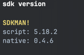
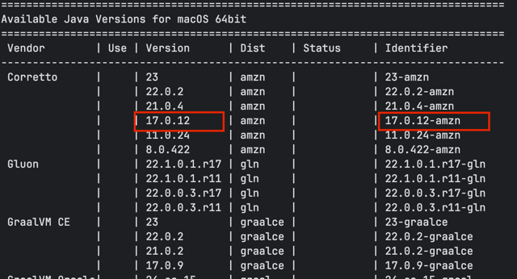

<!-- Title -->

# Initial Developer Computer setup &middot;  [](https://github.com/corretto/corretto-17/releases/tag/17.0.12.7.1)

Utility scripts/tools to set up a mac laptop for initial developer use

<!-- Requirements -->

## Requirements

Following tools were installed or tested on following

* MacBook Pro 13-inch, 2020 2 GHz Quad-Core Intel Core i5
* 16 GB 3733 MHz
* macOs Sonoma 14.4.1 or higher

<!-- Tools -->

#### Tools

* **Java17 :** Use sdkman to install latest java 17 (or specific version 17.0.12.7.1)
* **IDE-Intellij :** Use official intellij website - https://www.jetbrains.com/ (https://www.jetbrains.com/idea/)
* **Homebrew :** Homebrew installs packages to their own directory and then symlinks their files into /opt/homebrew.
  Install Homebrew from official website  https://brew.sh/

<!-- Install Steps -->

### Tools installation steps

* JDK
    * Use sdkman to install java
    * Navigate to The Software Development Kit Manager website https://sdkman.io/
    * Check Get started section or [Usage](https://sdkman.io/usage) section that lists command
       ```bash
          > curl -s "https://get.sdkman.io" | bash 
      ```
    * Once installed, check the sdkman version, that's installed
       ```bash
          > sdk version
       ```
      
    * Check available java versions to download using
       ```bash
          > sdk list java 
       ```
      
    * Select appropriate java version (I am using 17.0.12-amzn)
       ```bash
          > sdk install java 17.0.12-amzn
      
              Downloading: java 17.0.12-amzn
              In progress...
              ############################################################################################################# 100.0%
              Repackaging Java 17.0.12-amzn...
  
              Done repackaging...
              Cleaning up residual files...
  
              Installing: java 17.0.12-amzn
              Done installing!
  
              Setting java 17.0.12-amzn as default.
       ```
    * if you want to _remove_ a prior or some version, then (say 17.0.11-amzn version), then run uninstall command
       ```bash
         $ sdk unistall java 17.0.11-amzn
      ```
    * if you want to _use_ a specific version, then
      ```bash 
       > sdk use java 17.0.12-amzn
      ```
    * Check Java version
        ```bash
             $ java -version                                                                                                       
               
                openjdk version "17.0.12" 2024-07-16 LTS
                OpenJDK Runtime Environment Corretto-17.0.12.7.1 (build 17.0.12+7-LTS)
                OpenJDK 64-Bit Server VM Corretto-17.0.12.7.1 (build 17.0.12+7-LTS, mixed mode, sharing)
        ```
        ```bash
            $ which java                                                                         
               
              /Users/user/.sdkman/candidates/java/current/bin/java
        ```
* IntelliJ IDEA 2024.2.1
    * Download the IntelliJ IDEA-2024.2.1.dmg macOS Disk Image file
    * Mount it as another disk in your system
    * Copy IntelliJ IDEA to your Applications folder

## This manual is approach is not recommended. But if you have no other option, then follow below steps to download java manually.

* With in IDE :

          To develop Java applications in IntelliJ IDEA, you need the Java SDK (JDK).

          1) Navigate to File -> Project Structure -> SDK's. If the necessary JDK is already defined in IntelliJ IDEA,
          select it from the JDK list. 
          2) If the JDK is installed on your computer, but not defined in the IDE, select Add JDK and
            specify the path to the JDK home directory (for example,
            `/Users/hari/Library/Java/JavaVirtualMachines/corretto-17.0.12.7.1`).
          3) If you don't have the necessary JDK on your computer, select Download JDK. In the next dialog, specify the JDK
            vendor (for example, Amazon Corretto), version 17, change the installation path if required, and click Download.
            Java executable now should be installed automatically at
            `/Users/hari/Library/Java/JavaVirtualMachines/corretto-17.0.12.7.1/Contents/Home/bin/java`
* Use terminal to download tar manually from internet (~ 180M) and extract/verify
   ```bash
     $ cd ~
     $ cd Library/Java/JavaVirtualMachines/ 
     $ curl -LO https://corretto.aws/downloads/resources/17.0.12.7.1/amazon-corretto-17.0.12.7.1-macosx-x64.tar.gz
          ~/Library/Java/JavaVirtualMachines
         curl -LO https://corretto.aws/downloads/resources/17.0.12.7.1/amazon-corretto-17.0.12.7.1-macosx-x64.tar.gz
         % Total    % Received % Xferd  Average Speed   Time    Time     Time  Current
                                         Dload  Upload   Total   Spent    Left  Speed
         100  179M  100  179M    0     0  1111k      0  0:02:45  0:02:45 --:--:-- 1122k
     $ ll 
       -rw-r--r--  1 hari  staff   180M  <date> 00:25 amazon-corretto-17.0.12.7.1-macosx-x64.tar.gz
     $ tar -xvf amazon-corretto-17.0.12.7.1-macosx-x64.tar.gz
     $ mv amazon-corretto-17.jdk corretto-17.0.12.7.1 
     $ cd  ~/Library/Java/JavaVirtualMachines/corretto-17.0.12.7.1/Contents/Home/bin
    ```
    * Check Java version
      ```bash
           ~/Library/Java/JavaVirtualMachines/corretto-17.0.12.7.1/Contents/Home/bin
           ./java -version
           openjdk version "17.0.12" 2024-07-16 LTS
           OpenJDK Runtime Environment Corretto-17.0.12.7.1 (build 17.0.12+7-LTS)
           OpenJDK 64-Bit Server VM Corretto-17.0.12.7.1 (build 17.0.12+7-LTS, mixed mode, sharing)
         ```
        * Next, edit your terminal's profile.
            * If you're using zsh, this will be: ```vim ~/.zshrc ```
            * If you're using not using zsh, this will be: ```vim ~/.bash_profile ```
            * Inside, add the following new line anywhere in the file:

              ```bash
              $ export JAVA_HOME=/Users/hari/Library/Java/JavaVirtualMachines/corretto-17.0.12.7.1/Contents/Home                                                                                                       
              ```
              Note you have to replace as per your home directory name (ie., replace hari with your's)
            * Restart your terminal app (or source ~/.bash_profile or ~/.zshrc), and it should work properly.
            * Also if you have been using sdkman to install and use a specific version of java 17, that should be fine
              to use as well
            * or else uninstall that version of java using
            * ```bash 
                  sdk uninstall java 17.0.11-amzn --force
                  removed java 17.0.11-amzn.
              ```
